# fabio cassisa

creative technologist — design × code × curiosity

building creative ad-tech at **[adnami](https://adnami.io)** · shipping side projects after hours  
background in industrial design (polito), interaction design (kth + malmö uni)  
now deep in typescript, creative coding, crypto, and AI agents


  


---

#### now

🏗️ creative technologist @ [adnami](https://adnami.io) — html5 creatives, gsap animations, svelte tooling  
🧠 building **carlos core** — local-first ai agent workbench · typescript · vector db · mcp  
🖥️ building a terminal-style portfolio — hacker aesthetics, interactive cli  
🔧 refactoring & leveling up open source projects  
📚 studying: cs, design systems, mathematics, philosophy

#### bg

industrial & visual design → hci → interaction design → creative dev → full-stack builder  
i like things that sit between disciplines. code that feels designed. design that actually ships.

#### selected projects

| project | what | stack |
|---------|------|-------|
| **[lia-tattoo](https://lia-tattoo.vercel.app/en)** | tattoo booking platform — live | next.js · supabase · typescript · tailwind |
| **[net assets scraper](https://github.com/fabio-cassisa/ChromeAssetsScraper/releases/latest)** | brand asset extractor — logos, colors, fonts, videos from any site into a brand kit | javascript · chrome extension · manifest v3 |
| **[lost satellites](https://lostsatellite-v1.netlify.app)** | design studio landing | react · gsap · css |
| **[4foodies](https://github.com/fabio-cassisa/4foodies24_landing)** | food brand landing page | next.js · tailwind · typescript |
| **[webgi starter](https://github.com/fabio-cassisa/webgi_vanilla_starter)** | 3d product showcase | typescript · webgi sdk · vite |

```text
> links

x            twitter.com/FabioCassisa
linkedin     linkedin.com/in/fabiocassisa
mastodon     mastodon.social/@Dagas
```

---

<sub>open source lover · continuous learner · terminal dweller · polymath in progress</sub>
