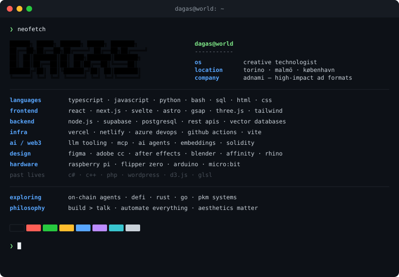

# fabio cassisa

creative technologist — design × code × curiosity

building creative ad-tech at **[adnami](https://adnami.io)** · shipping side projects after hours  
background in industrial design (polito), interaction design (kth + malmö uni)  
now deep in typescript, creative coding, crypto, and AI agents


  


---

#### now

🏗️ creative technologist @ [adnami](https://adnami.io) — html5 creatives, gsap animations, ai agentic pipelines  
🧠 building **carlos core** — local-first ai agent workbench · typescript · vector db · mcp  
🌐 [**dagas.dev**](https://dagas.dev) — terminal-inspired portfolio, freshly shipped  
📚 studying: cs, design systems, mathematics, philosophy

#### bg

industrial & visual design → hci → interaction design → creative dev → full-stack builder  
i like things that sit between disciplines. code that feels designed. design that actually ships.

#### selected projects

| project | what | stack |
|---------|------|-------|
| **[net-assets-scraper](https://github.com/fabio-cassisa/net-assets-scraper)** | brand asset extractor — logos, colors, fonts, videos from any site | `javascript` · `chrome extension` · `manifest v3` |
| **[dev-wellness](https://dev-wellness.vercel.app)** | developer wellness dashboard — timers, habits, mood, weekly stats | `react` · `redux toolkit` · `vite` · `vercel` |
| **[lost-satellites](https://lostsatellite-v1.netlify.app)** | design studio landing with scroll-driven animations | `react` · `gsap` · `css` |
| **[3d-product-viewer](https://github.com/fabio-cassisa/3d-product-viewer)** | scroll-driven 3d product showcase | `typescript` · `webgi sdk` · `vite` |
| **[resonance](https://github.com/fabio-cassisa/resonance)** | hardware × software — micro:bit sensor bridge | `javascript` · `micro:bit` · `web serial` |
| **[my-tasks](https://github.com/fabio-cassisa/my-tasks)** | minimal task manager with drag-to-reorder and themes | `react` · `zustand` · `vite` |
| **[lia-tattoo](https://lia-tattoo.vercel.app/en)** | tattoo booking platform — live client project | `next.js` · `supabase` · `typescript` · `tailwind` |

```text
> links

portfolio    dagas.dev
x            twitter.com/FabioCassisa
linkedin     linkedin.com/in/fabiocassisa
mastodon     mastodon.social/@Dagas
```

---

<sub>open source lover · continuous learner · terminal dweller · polymath in progress</sub>
